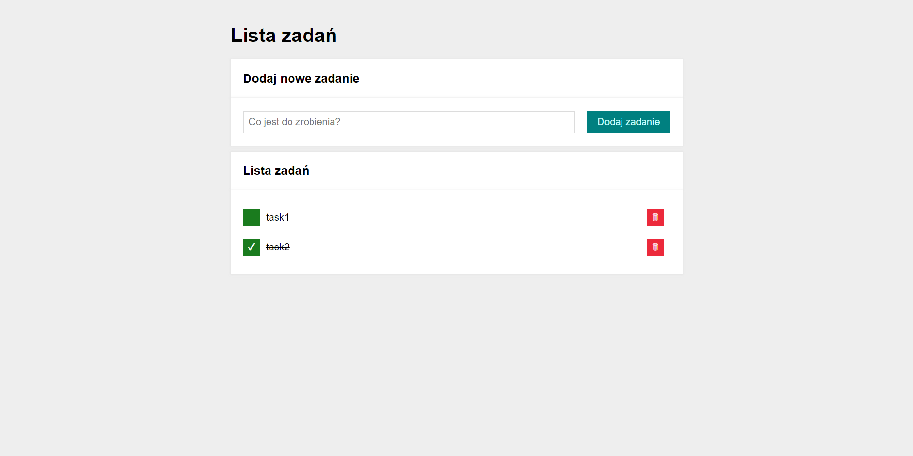

# To-do list
Third project made as a part of YouCode course. It is a simple web application that allows you to add new tasks, remove them and mark as done.

## Demo:
https://p-michalski.github.io/to-do-list/

## Tools used:
- HTML
- CSS
- Javascript

*Project was made, using BEM convention.*
